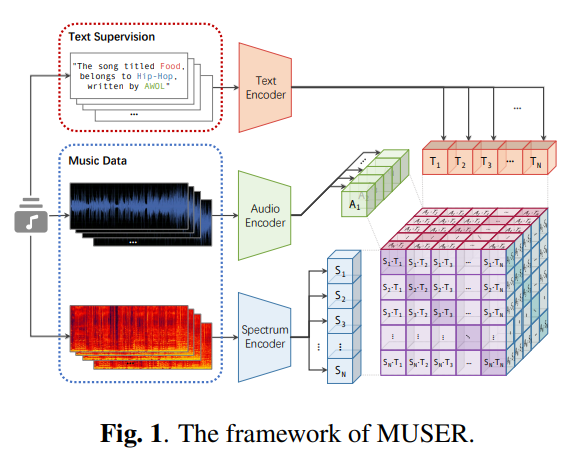

# LEARNING MUSIC SEQUENCE REPRESENTATION FROM TEXT SUPERVISION (Accepted by ICASSP'22)

This is the origin pytorch implementation of the paper in the following paper: [LEARNING MUSIC SEQUENCE REPRESENTATION FROM TEXT SUPERVISION](https://ieeexplore.ieee.org/document/9746131/). Special thanks to `Yuan Xie`@[xy980523](https://github.com/xy980523) for building this repo.


## Tri-modal Contrastive Learning



## Example Usage

```
python demo.py
```


## Pre-train weights

1. For CLIP, we provide [bpe_simple_vocab_16e6.txt.gz](
https://drive.google.com/uc?export=download&id=1TvyohfY3Q8DueKLjZlS2pYYEPT4ylNpX) and [CLIP.pt](
https://drive.google.com/uc?export=download&id=1nwIJAJqyOz3uVjObWB3YvkT4OqJTxWjp)

2. The other weights pre-trained on AudioSet, including [wavelet_encoder.pt](
https://drive.google.com/uc?export=download&id=1KJD9u3qBfAj9Wzl1w9XbnlyA6_HKu_co) and [MUSER.pt](
https://drive.google.com/uc?export=download&id=1zNCByQSZE4imueZMYeWJZ80zQbxy2jFB)


## <span id="citelink">Citation</span>

If you find the repository useful in your research, please consider citing the following paper:

```
@inproceedings{chen2022learning,
  title={Learning Music Sequence Representation From Text Supervision},
  author={Chen, Tianyu and Xie, Yuan and Zhang, Shuai and Huang, Shaohan and Zhou, Haoyi and Li, Jianxin},
  booktitle={ICASSP 2022-2022 IEEE International Conference on Acoustics, Speech and Signal Processing (ICASSP)},
  pages={4583--4587},
  year={2022},
  organization={IEEE}
}
```
